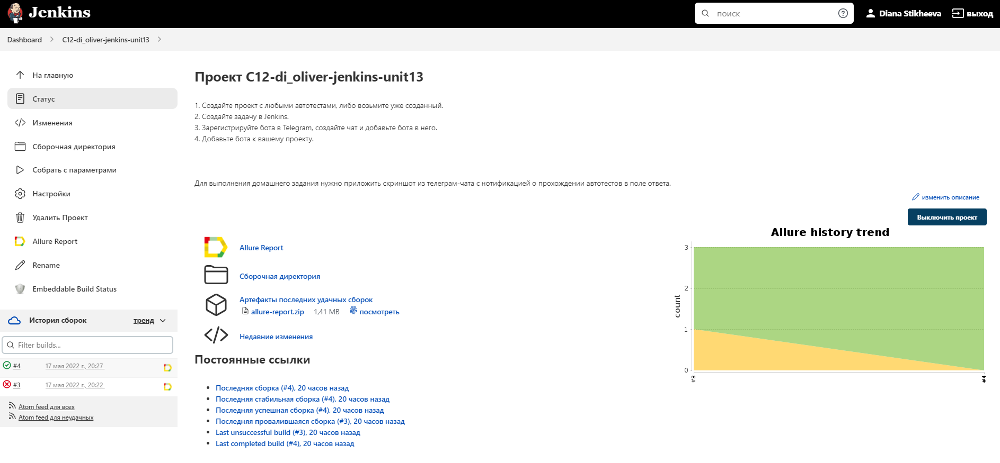
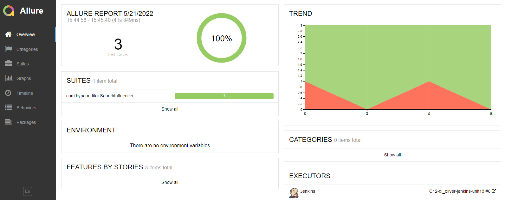
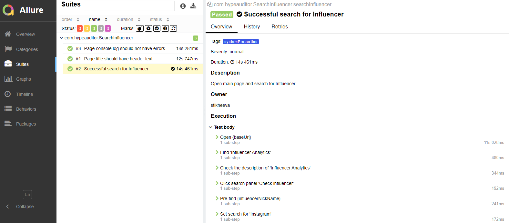
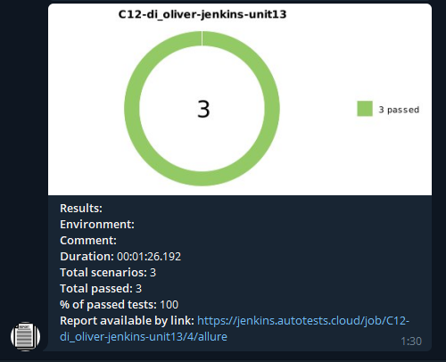
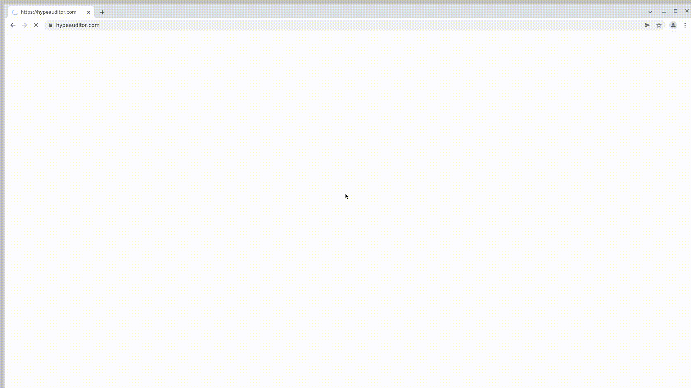

# hypeauditor-autotests

# Проект по автоматизации тестирования сайта <a target="_blank" href="https://hypeauditor.com/">HypeAuditor</a>

## :floppy_disk: Содержание:

- <a href="#computer-технологии-и-инструменты">Технологии и инструменты</a>
- <a href="#notebook_with_decorative_cover-реализованные-проверки">Реализованные проверки</a>
- <a href="#electric_plug-сборка-в-Jenkins">Сборка в Jenkins</a>
- <a href="#arrow_forward-запуск-из-терминала">Запуск из терминала</a>
- <a href="#open_book-allure-отчет">Allure отчет</a>
- <a href="#robot-отчет-в-telegram">Отчет в Telegram</a>
- <a href="#film_projector-видео-примеры-прохождения-тестов">Видео примеры прохождения тестов</a>

## :computer: Технологии и инструменты
<p align="center">


</p>

## :notebook_with_decorative_cover: Реализованные проверки
- Проверка наличия надписи 100% AI-Powered Influencer Marketing Platform | HypeAuditor
- Проверка текста подсказки по наведению на функцию "Influencer Analytics"
- Проверка поиска инфлюенсера
- Проверка ФИО инфлюенсера 
- Проверка перехода на старницу анализа страницы инфлюенсера в Instagram
- Проверка отсутствия ошибок в консоли бразуера

## :electric_plug: Сборка в Jenkins
### <a target="_blank" href="https://jenkins.autotests.cloud/job/C12-di_oliver-jenkins-unit13/">Сборка в Jenkins</a>
<p align="center">

</p>  

## :arrow_forward: Запуск из терминала
Локальный запуск:
```
gradle clean systemProperties -DremoteSelenideUrl=selenoid.autotests.cloud -DbaseUrl=https://hypeauditor.com -Dbrowser=chrome -DbrowserVer=100.0 -DbrowserSize=1920x1080
```

Удаленный запуск:
```
clean
systemProperties
-DremoteSelenideUrl=${REMOTESELENIDEURL}
-DbaseUrl=${BASEURL}
-Dbrowser=${BROWSER}
-DbrowserVer=${BROWSER_VERSION}
-DbrowserSize=${BROWSER_SIZE}
```

## :open_file_folder: Allure отчет
- ### Главный экран отчета
<p align="center">

</p>

- ### Страница с проведенными тестами
<p align="center">

</p>

## :memo: Отчет в Telegram
<p align="center">

</p>

## :film_strip: Видео пример прохождения тестов
> К каждому тесту в отчете прилагается видео.
<p align="center">
  
</p>